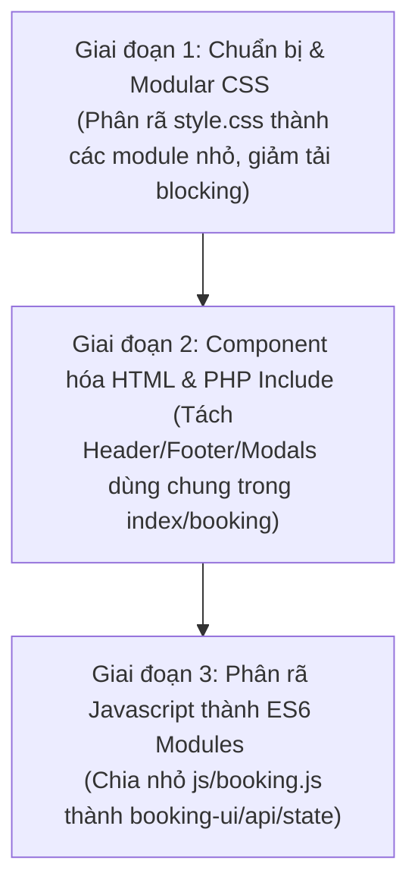

# Lộ trình Tái cấu trúc & Phân rã File Lớn (Long-term Refactoring & Maintainability Roadmap)

Tài liệu này phân tích chi tiết nợ kỹ thuật (Technical Debt) của các file có kích thước lớn trong hệ thống và đưa ra giải pháp kiến trúc, lộ trình phân rã cụ thể nhằm tối ưu hóa tính bảo trì (Maintainability) và hiệu năng (Performance) khi dự án tiếp tục mở rộng.

---

## 1. Phân tích chi tiết & Giải pháp cho từng File lớn

### 1.1. `style.css` (Kích thước: ~100KB)
* **Vấn đề:** Chứa toàn bộ mã CSS của trang khách hàng (Customer), trang quản trị (Admin), các modal, hiệu ứng động và theme. Gây ra hiện tượng chặn hiển thị (Render-blocking) không cần thiết cho khách hàng khi phải tải cả CSS của trang Admin.
* **Giải pháp phân rã:**
  - Tách thành các file CSS chuyên biệt theo mô hình **Modular CSS**:
    - `css/theme.css`: Chứa các biến HSL, design tokens, cấu hình Dark/Light Mode.
    - `css/base.css`: Cấu hình typography, resets, và grid/flexbox layout chung.
    - `css/components/`: Thư mục chứa CSS của các component độc lập (nút, input, modal, cart-drawer, booking-drawer).
    - `css/pages/booking.css`: Chỉ chứa CSS cho trang đặt bàn.
    - `css/pages/admin.css`: Chỉ chứa CSS cho giao diện quản trị Admin (chỉ tải khi vào trang admin).
  - **Tích hợp:** Sử dụng `@import` trong file `style.css` gốc để liên kết các module này trong môi trường phát triển, hoặc sử dụng PostCSS/Vite để đóng gói (bundle) và tối ưu hóa khi lên môi trường Production.

---

### 1.2. `booking.html` (~75KB) & `index.html` (~57KB)
* **Vấn đề:** Chứa cấu trúc HTML tĩnh cực kỳ lớn do lặp lại các thành phần dùng chung như: Header, Footer, Thanh điều hướng (Navbar), Hộp thoại Đăng nhập/Đăng ký (Auth Modals), và Giỏ hàng (Cart Drawer).
* **Giải pháp phân rã:**
  - **Phương án 1 (Server-side PHP - Khuyên dùng):** Đổi đuôi các file này thành `.php` và sử dụng lệnh `include` hoặc `require` của PHP để tái sử dụng mã nguồn:
    - `components/header.php`, `components/footer.php`, `components/auth_modal.php`, `components/cart_drawer.php`.
  - **Phương án 2 (Client-side Component Loader):** Nếu bắt buộc giữ nguyên định dạng `.html` tĩnh, có thể tách các component thành các file HTML nhỏ trong thư mục `components/` và viết một hàm helper Javascript sử dụng `fetch` để nạp động chúng vào DOM khi trang tải:
    ```javascript
    async function loadComponent(elementId, componentPath) {
        const response = await fetch(componentPath);
        document.getElementById(elementId).innerHTML = await response.text();
    }
    ```

---

### 1.3. `js/booking.js` (~39KB)
* **Vấn đề:** Đảm nhận quá nhiều trách nhiệm (Vi phạm nguyên lý Đơn nhiệm - Single Responsibility Principle): vừa quản lý trạng thái đơn đặt bàn, xử lý sự kiện DOM của bản đồ bàn, thực hiện gọi API kiểm tra trạng thái bàn bận, tính toán tiền cọc của món ăn đặt trước (preorder items) và xử lý hiển thị QR Code.
* **Giải pháp phân rã:** Chuyển đổi sang kiến trúc **ES6 Modules**:
  - `js/booking/booking-state.js`: Quản lý dữ liệu giỏ hàng preorder, thông tin khách hàng, ngày giờ đặt.
  - `js/booking/booking-ui.js`: Xử lý tương tác bản đồ bàn (SVG/DOM), render danh sách món ăn đặt trước và cập nhật giao diện.
  - `js/booking/booking-api.js`: Xử lý toàn bộ các yêu cầu AJAX/Fetch tới API (`get_booked_tables.php`, `book_table.php`).
  - `js/booking/booking-payment.js`: Xử lý tạo URL QR Code và kiểm tra trạng thái thanh toán cọc.
  - **Tích hợp:** Nhúng module chính vào trang bằng `<script type="module" src="js/booking/main.js">`.

---

### 1.4. `admin/sidebar.php` (~30KB)
* **Vấn đề:** Sidebar chứa mã HTML tĩnh của menu điều hướng kết hợp với rất nhiều CSS inline và các logic PHP rườm rà để kiểm tra xem mục menu nào đang hoạt động (active state).
* **Giải pháp phân rã:**
  - **Cấu hình hóa Menu (Config-driven):** Tách cấu trúc danh sách menu ra một file cấu hình PHP Array độc lập đặt tại `config/sidebar_menu.php`:
    ```php
    return [
        ['title' => 'Dashboard', 'icon' => 'fa-tachometer-alt', 'link' => 'dashboard.php'],
        ['title' => 'Bookings', 'icon' => 'fa-calendar-alt', 'link' => 'bookings.php'],
        // ...
    ];
    ```
  - Trong `sidebar.php`, chỉ cần gọi file config này và chạy một vòng lặp `foreach` ngắn để render HTML động. Điều này giúp giảm 80% kích thước file, loại bỏ trùng lặp code và cực kỳ dễ dàng khi muốn thêm/bớt tính năng.

---

## 2. Lộ trình Triển khai Đề xuất (Refactoring Roadmap)

Để đảm bảo dự án vận hành an toàn tuyệt đối và không ảnh hưởng đến các bản demo hiện tại, lộ trình tái cấu trúc nên được chia làm 3 giai đoạn:



1. **Giai đoạn 1 (Ưu tiên Cao - Dễ làm):** Thực hiện phân rã `style.css`. Việc này cải thiện ngay lập tức điểm hiệu năng Lighthouse (Core Web Vitals) mà rủi ro logic là bằng 0.
2. **Giai đoạn 2 (Ưu tiên Trung bình):** Tách các component HTML tĩnh sang PHP include (nếu chuyển đổi sang PHP pages) giúp quản lý các thẻ meta SEO, header và footer ở một nơi duy nhất.
3. **Giai đoạn 3 (Ưu tiên Thấp - Cần Test kỹ):** Phân rã `js/booking.js` thành các module nhỏ. Giai đoạn này đòi hỏi chạy lại toàn bộ các bộ kiểm thử smoke tests/E2E để đảm bảo tính năng đặt bàn và thanh toán QR hoạt động hoàn hảo.
